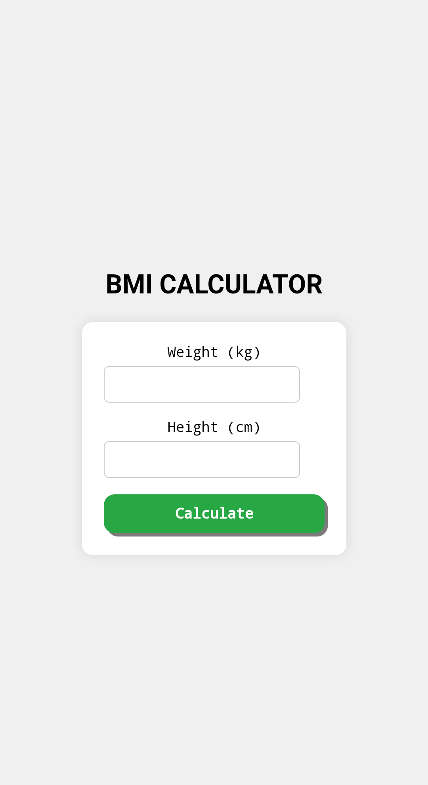

# BMI-CALCULATOR

A simple web-based BMI (Body Mass Index) calculator built with HTML, CSS, and JavaScript.

## Features

- Calculate BMI based on weight and height.
- Display BMI category (Underweight, Normal, Overweight).
- Responsive design.

## Demo



## How to Use

1. Clone the repository:
    ```sh
    git clone https://github.com/Ajmalkhan01/BMI-CALCULATOR.git
    ```
2. Navigate to the project directory:
    ```sh
    cd BMI-CALCULATOR
    ```
3. Open `index.html` in your web browser.

## Technologies Used

- HTML
- CSS
- JavaScript

## Contributing

Contributions are welcome! Please open an issue or submit a pull request.

## License

This project is licensed under the MIT License.
